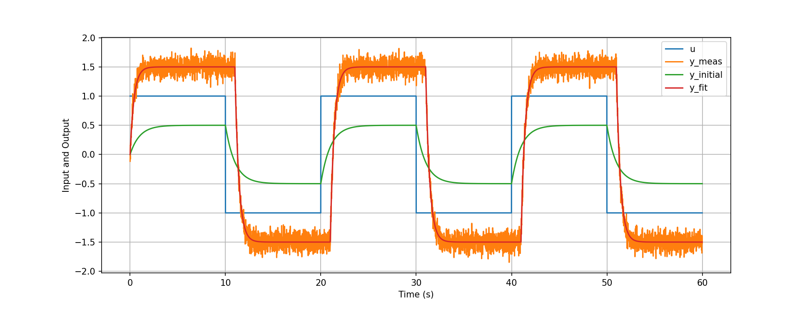

# First-order plus deadtime (FOPDT) model system id

This library implements a gradient-approach to fit a first-order plus deadtime (FOPDT) model to input and output data. Specifically, it fits the following model

$$
\tau \frac{d}{dt} y(t) =  - y(t) + K u(t - \theta).
$$

Where $y$ is the output, $u$ the input, $t$ is time. The unknown parameters that are estimated are
- $\tau$ = process time constant
- $K$ = process gain
- $\theta$ = process dead time

## Dependencies
- Numpy
- Scipy (for simulation and filtering in the example)
- Matplotlib (for plotting)

## Contents
- [FOPDT_fitter.py](FOPDT_fitter.py) contains the library for model fitting.
- [example.ipynb](example.ipynb) shows and example using the library.

## Usage
To library can be used the following way:

```python
# import the library
import FOPDT_fitter

# initial guess of parameters
tua_0 = 1
K_0 = 0.5
theta_0 = 0

# call the fit_model function with initial guess, 
# and input, output and time vector
tua, K, theta = FOPDT_fitter.fit_model(tua_0, K_0, theta_0, u, y, t)
```

The graph below shows the result of the example. The blue line is the input signal $u$, and the orange line the measured output $y$. The initial guess is shown in green, and the fitted model in red.


## The algorithm
The library makes use of the [Gauss–Newton algorithm](https://en.wikipedia.org/wiki/Gauss%E2%80%93Newton_algorithm) to solve a non-linear least squares problem in which the residuals are penalized. A [backtracking line search](https://en.wikipedia.org/wiki/Backtracking_line_search) is implemented as a globalization strategy.

Because it is a gradient based algorithm, the library is sensitive to the initial guess. It is therefore recommended using a good initial guess. Also, as shown in the example, the algorithm is sensitive to noise in the data. Therefore, it is recommended to filter the data before fitting the model.

## Future work
- Expanding it to multiple inputs.